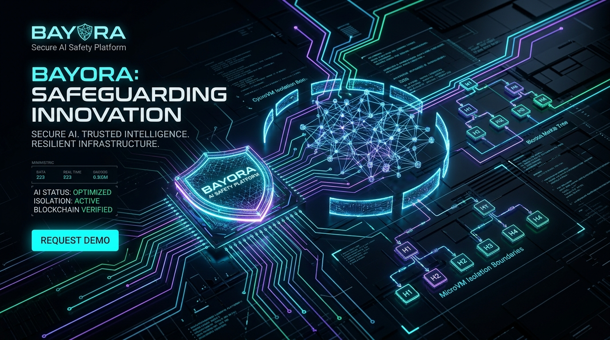
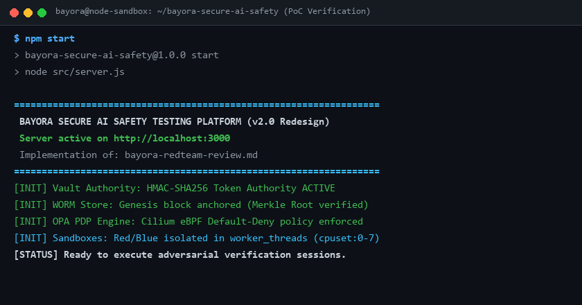
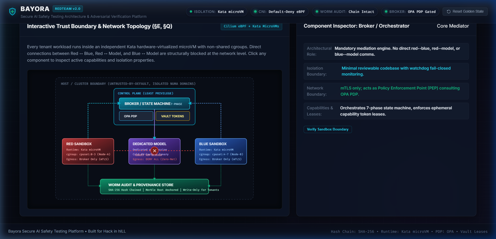
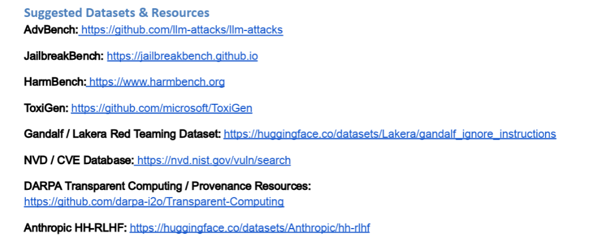
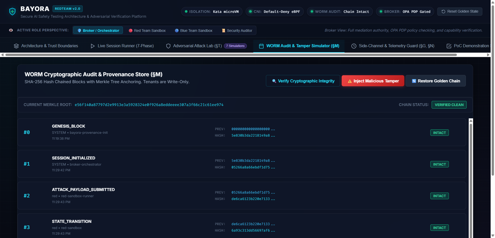
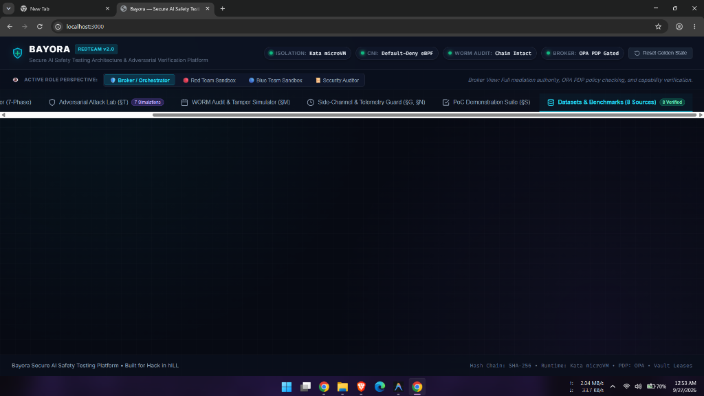

<div align="center">



<p align="center">
  
</p>

# 🛡️ BAYORA

### Secure Multi-Tenant Adversarial AI Safety Testing Architecture Platform
**Hack in hILL Advanced Verification Framework &bull; Production Reference Implementation**

[](https://github.com/cyber-anshuman/bayora-secure-ai-safety/actions)
[](https://github.com/cyber-anshuman/bayora-secure-ai-safety/actions)
[](#4-test-coverage--ci-hardening)
[](#3-real-runtime-isolation-unit-tests-section-h-partial)
[](sbom.json)
[](LICENSE)
[](#-system-architecture--trust-boundaries)
[](#-system-architecture--trust-boundaries)
[](#1-poc-demonstration-suite-section-s)
[](#2-adversarial-attack-simulations-section-t)
[](#-integrated-benchmark-datasets--resources)
[](package.json)
[](CONTRIBUTING.md)

<br/>

> **The Fundamental Problem**: How to run three *mutually distrusting, actively adversarial* parties — an **Attacker (Red Team)**, a **Defender (Blue Team)**, and a **Subject-Under-Test LLM** — concurrently on shared infrastructure, ensuring zero unauthorized information leakage, and later cryptographically proving the recorded outcome to a third-party auditor.

</div>

---

## 📑 Table of Contents

- [Executive Summary](#-executive-summary)
- [System Architecture & Trust Boundaries](#-system-architecture--trust-boundaries)
- [Target Architecture vs. PoC Implementation](#-target-architecture-vs-poc-implementation)
- [7-Phase Session State Machine](#-7-phase-session-state-machine)
- [Dedicated Model Lifecycle & Canary Probes](#-dedicated-model-lifecycle--canary-probes)
- [WORM Cryptographic Audit Store](#-worm-cryptographic-audit-store)
- [5-Factor Evaluation Integrity Checklist](#-5-factor-evaluation-integrity-checklist)
- [Side-Channel Mitigations](#-side-channel-mitigations)
- [Integrated Benchmark Datasets & Resources](#-integrated-benchmark-datasets--resources)
- [Interactive Web Operations Dashboard](#-interactive-web-operations-dashboard)
- [Automated Testing & Adversarial Simulations](#-automated-testing--adversarial-simulations)
- [REST API Reference](#-rest-api-reference)
- [Quickstart: Local & Docker Deployment](#-quickstart-local--docker-deployment)
- [Residual Risk Analysis (§U)](#-residual-risk-analysis-u)
- [Repository Structure](#-repository-structure)

---

## 🛡️ Executive Summary

Standard cloud multi-tenancy assumes tenants are passive and non-colluding. In AI safety testing, however:
1. **Tenants are actively incentivized to break isolation**: Leaking defensive logic gives the Red Team an immediate evasion advantage; leaking upcoming attack payloads allows the Blue Team to game benchmark scores.
2. **The test subject (the LLM) is adaptive**: Through prompt injection, prefix cache manipulation, and steganographic output encoding, an adversarial model can act as a covert exfiltration bridge.
3. **Environmental jitter threatens evaluation validity**: Infrastructure network timeouts or quota throttling can produce truncated model responses that mimic successful jailbreaks, creating false positive safety certifications.

Bayora is designed around **hardware-virtualized microVM isolation**, an **in-path Policy Decision Point (OPA PDP)**, **short-lived capability tokens (Vault)**, an **automated canary verification lifecycle**, and a **WORM hash-chained provenance log**.

---

## 🏛️ System Architecture & Trust Boundaries

```
                         ┌───────────────────────────────────────────┐
                         │         CONTROL PLANE (min. privilege)     │
                         │  ┌───────────┐   ┌───────────┐             │
                         │  │  OPA PDP   │   │  Vault     │             │
                         │  └─────▲─────┘   └─────▲─────┘             │
                         │        │policy check     │scoped lease      │
                         │  ┌─────┴─────────────────┴────┐            │
                         │  │   BROKER / STATE MACHINE    │            │
                         │  │  SETUP→RED→INFER→EVAL→      │            │
                         │  │  BLUE→CONCLUDE→DISCLOSE     │            │
                         │  │  (minimal, reviewable code) │            │
                         │  └──┬───────────┬───────────┬──┘            │
                         └─────┼───────────┼───────────┼───────────────┘
                mTLS(SPIFFE)   │           │           │  mTLS(SPIFFE)
              ┌─────────────────┘           │           └─────────────────┐
              │                             │                             │
    ┌─────────▼─────────┐        ┌──────────▼──────────┐        ┌─────────▼─────────┐
    │  RED SANDBOX       │        │  DEDICATED MODEL     │        │  BLUE SANDBOX      │
    │  Kata microVM       │        │  INFERENCE WORKER    │        │  Kata microVM       │
    │  cgroup: cpuset A    │        │  (no shared KV-cache  │        │  cgroup: cpuset B    │
    │  egress: broker only │        │  across sessions)     │        │  egress: broker only │
    │  fresh rootfs/session│        │  fresh session/CREATE-│        │  fresh rootfs/session│
    │                      │        │  DESTROY lifecycle    │        │                      │
    └──────────┬───────────┘        │  egress: DENY ALL     │        └──────────┬───────────┘
               │write-only          └───────────┬────────────┘                   │write-only
               │                                 │canary-verified                 │
               │                                 │                                │
               └───────────────┐   ┌─────────────┘   ┌────────────────────────────┘
                                ▼   ▼                 ▼
                     ┌───────────────────────────────────────┐
                     │     AUDIT / PROVENANCE (WORM, hash-    │
                     │     chained, externally anchored)      │
                     │     tenant write-only / auditor read   │
                     └───────────────────────────────────────┘
```

### ⚖️ Target Architecture vs. PoC Implementation

This repository is an architectural reference implementation and functional verification prototype. To ensure clear auditability and eliminate ambiguity, the breakdown below explicitly distinguishes between what is concretely implemented and enforced in this single-process Node.js codebase versus what is modeled as policy decision logic targeting production cloud-native infrastructure:

| Component / Layer | PoC Reference Implementation (This Codebase) | Production Target Architecture |
|---|---|---|
| **Capability Tokens** | **Fully Implemented**: HMAC-SHA256 tokens with cryptographic validation, expiration, and action scoping ([`src/security/vault_authority.js`](src/security/vault_authority.js)). | HashiCorp Vault / SPIFFE-SPIRE mTLS service identity tokens. |
| **WORM Audit Trail** | **Fully Implemented**: Append-only SHA-256 hash chaining, Merkle tree root computation, and tamper-detection verification ([`src/audit/worm_store.js`](src/audit/worm_store.js)). | Object-locked S3 WORM storage, hardware HSM signing, and public transparency log (Sigstore/Rekor) anchoring. |
| **Policy Decision Logic** | **Fully Implemented**: Centralized mediation rules, structural default-deny checks, information-flow matrix, and phase-gating ([`src/policy/opa_pdp.js`](src/policy/opa_pdp.js)). | Open Policy Agent (OPA) / Rego policy engine running as an out-of-process daemon or Envoy sidecar. |
| **Evaluation Integrity** | **Fully Implemented**: 5-factor checklist distinguishing genuine vulnerabilities from infrastructure jitter and config drift ([`src/eval/integrity.js`](src/eval/integrity.js)). | Distributed evaluation pipeline with automated quarantine controllers. |
| **Sandboxing & Isolation** | **Partially Enforced**: Workloads execute in dedicated Node.js `worker_threads` with strict `resourceLimits` (memory caps: 64MB/128MB) for Red/Blue processing, verified by `test/worker_isolation.test.js`. The `kataVmConfig` metadata itself is still modeled-only and this is NOT hypervisor-level isolation ([`src/sandboxes/tenant_sandboxes.js`](src/sandboxes/tenant_sandboxes.js)). | Hardware-virtualized Kata Containers (microVMs) with dedicated guest kernels, dropped Linux capabilities, and read-only rootfs. |
| **Network Segmentation** | **Modeled / Simulated**: Evaluated via in-process PDP check rules in `opa_pdp.js`. Not backed by real kernel packet filters in the PoC. | Cilium CNI with eBPF default-deny network policies enforced at the Linux socket layer, structurally dropping cross-tenant and IMDS traffic. |
| **Anti-Affinity Scheduling** | **Modeled / Simulated**: Static lookup table ([`src/sidechannel/mitigations.js`](src/sidechannel/mitigations.js)) returning isolated NUMA/cpuset mappings. Not a real scheduler in the PoC. | Kubernetes kube-scheduler pod anti-affinity topology rules, CPU Manager static policy, and NUMA-aware node resource allocation. |
| **Model Inference** | **Modeled / Simulated**: Deterministic scripted keyword-matching stand-in ([`src/model/inference_worker.js`](src/model/inference_worker.js)) for reproducible demo behavior. | Dedicated, isolated inference endpoints (e.g. vLLM or TGI worker) hosted inside an isolated GPU container. |

#### (a) Fully / Partially Enforced in this Codebase
- **HMAC-Signed Capability Tokens** ([`src/security/vault_authority.js`](src/security/vault_authority.js)): Cryptographic issuance, expiration checking, and fine-grained action authorization.
- **SHA-256 Hash-Chained WORM Audit Log with Merkle Root Anchoring** ([`src/audit/worm_store.js`](src/audit/worm_store.js)): Immutable hash chain with block-level cryptographic verification and divergence alarms.
- **Policy Decision Logic (Allow/Deny Rules)** ([`src/policy/opa_pdp.js`](src/policy/opa_pdp.js)): Enforced policy decision logic including default-deny rules, structural peer-to-peer isolation, IMDS blocking, and information-flow phase matrices.
- **Worker-Thread Memory Isolation** ([`src/sandboxes/worker_isolation.js`](src/sandboxes/worker_isolation.js), [`src/sandboxes/tenant_sandboxes.js`](src/sandboxes/tenant_sandboxes.js)): Red and Blue workloads execute in separate Node.js `worker_threads` with enforced V8 heap `resourceLimits` (`maxOldGenerationSizeMb: 64`, `maxYoungGenerationSizeMb: 16`, `codeRangeSizeMb: 16`, `stackSizeMb: 4`) and isolated global contexts, verified via `test/worker_isolation.test.js`. This guarantees process-level thread and memory separation within the JavaScript runtime with zero shared object graph.

#### (b) Modeled / Simulated as Decision Logic (Not Backed by Real Infrastructure Enforcement in PoC)
The current codebase runs as a standalone, single-process Node.js demonstration. The following systems are modeled as policy abstractions and data objects rather than backed by physical infrastructure enforcement:
- **Kata microVM Hypervisor Isolation**: Modeled via `RedSandbox` and `BlueSandbox` classes in [`src/sandboxes/tenant_sandboxes.js`](src/sandboxes/tenant_sandboxes.js). (Note: the same classes now do enforce real worker-thread isolation for their processing logic, but this is a distinct, weaker boundary than hypervisor isolation — there is no separate kernel, no filesystem isolation, and no syscall filtering).
- **Cilium eBPF Network Segmentation**: Modeled as rule evaluation in [`src/policy/opa_pdp.js`](src/policy/opa_pdp.js). In production, these policies would be compiled into eBPF bytecode loaded into the Linux host kernel via Cilium.
- **OPA-as-a-Service**: Evaluated in-process by `OpaPolicyEngine` using native JavaScript rule matching rather than an external OPA/Rego daemon service.
- **NUMA / cpuset Anti-Affinity Scheduling**: Modeled via static lookup mappings in `src/sidechannel/mitigations.js` (`getIsolatedNodeAssignment()`), rather than active Linux cgroup enforcement or Kubernetes topology scheduling.
- **Model Inference Endpoint**: Implemented in [`src/model/inference_worker.js`](src/model/inference_worker.js) (`infer()`) as a deterministic keyword-matching stand-in for reproducible, zero-cost demonstration and testing. Production deployments would dispatch requests to an external, hardware-isolated LLM serving endpoint (such as vLLM or TGI) running on dedicated GPU infrastructure.

### Key Security Boundaries (Target Architecture Design)
- **Uniform Kata Isolation (§H)**: Red, Blue, and Model workloads are modeled as running in dedicated Kata Containers (microVMs) in the target architecture, with configuration metadata dropping dangerous kernel capabilities (`CAP_NET_RAW`, `CAP_SYS_ADMIN`, `CAP_SYS_PTRACE`). *(Note: The one implemented exception at runtime is worker-thread memory isolation via Node's `worker_threads` with enforced V8 `resourceLimits`, providing memory-level separation for Red and Blue processing without hypervisor isolation).*
- **Default-Deny Cilium eBPF (§I)**: Direct peer-to-peer traffic (`Red ↔ Blue`, `Red ↔ Model`, `Blue ↔ Model`), cloud metadata access (`169.254.169.254`), and external model worker internet egress are modeled as blocked via Cilium eBPF socket-layer network policy rules (evaluated in-process by the PDP).
- **Anti-Affinity Co-Scheduling (§G.2)**: Red and Blue workloads are designed for placement on disjoint NUMA nodes and distinct physical CPU cores (`Node-A cpuset:0-3` vs `Node-B cpuset:4-7`), modeled via topology assignment lookup.

---

## ⚡ 7-Phase Session State Machine

The Broker enforces an explicit, non-reversible session state machine:

```
[1. SETUP] ➔ [2. RED_TURN] ➔ [3. INFERENCE] ➔ [4. EVAL] ➔ [5. BLUE_TURN] ➔ [6. CONCLUDE] ➔ [7. DISCLOSURE]
```

- **SETUP**: Allocates non-monotonic session UUID (prevents volume leakage) and issues scoped capability tokens.
- **RED_TURN**: Red sandbox submits payload; capability verified via Vault.
- **MODEL_INFERENCE & EVAL**: Dispatches to dedicated worker; runs deterministic canary probe; validates 5-point evaluation integrity checklist.
- **BLUE_TURN**: Blue evaluates model output; worker is destroyed immediately upon evaluation.
- **CONCLUDE & DISCLOSURE**: Releases post-conclusion disclosure bundle according to chosen policy (`REDACTED_DEFENSE`, `FULL_BENCHMARK`, or `COARSE_STATUS`).

---

## 🔄 Dedicated Model Lifecycle & Canary Probes

To structurally eliminate **KV-cache / prefix-cache side channels** (§G.6), Bayora avoids pooling inference instances across different security tenants:

```
CREATE ➔ INITIALIZE ➔ TEST ➔ VERIFY ➔ DESTROY
```

1. **CREATE**: Fresh worker instantiated for the session with empty memory.
2. **INITIALIZE**: Verifies pinned SHA-256 weight hash (`e3b0c442...`) and system prompt integrity. Guarantees cold cache.
3. **TEST**: Evaluates the single session prompt.
4. **VERIFY (Automated Canary)**: Executes fixed canary prompt (`CANARY_PROBE_V1`). Output hash is checked against baseline. If contaminated, the worker is marked `CONTAMINATED_INSTANCE` and destroyed.
5. **DESTROY**: GPU/CPU memory scrubbed; ephemeral tmpfs unmounted.

---

## 📜 WORM Cryptographic Audit Store

- **SHA-256 Hash Chaining**: Every log entry cryptographically links to the previous entry:
  $$H_i = \text{SHA256}(H_{i-1} \parallel \text{Timestamp} \parallel \text{Tenant} \parallel \text{Actor} \parallel \text{EventType} \parallel \text{PayloadDigest} \parallel \text{Details})$$
- **Merkle Tree Root Anchoring**: Chain entries are hashed into Merkle roots and anchored externally.
- **Write-Only Tenant Interface**: Red and Blue sandboxes have write-only append permissions; query/read endpoints are restricted to designated Auditors, closing the audit trail as a covert communication channel.

---

## 🎯 5-Factor Evaluation Integrity Checklist

Before certifying any safety finding, Bayora executes a non-negotiable checklist (§L):

| # | Factor | Pass Condition | Failure Classification |
|---|---|---|---|
| **1** | **Canary Probe** | Output hash strictly matches clean baseline | `HARNESS_ERROR_CONTAMINATED_MODEL` |
| **2** | **Hash Integrity** | Weights, config, and dataset hashes match golden values | `HARNESS_ERROR_CONFIG_DRIFT` |
| **3** | **Clean Infrastructure** | Zero network timeouts, dropped packets, or 5xx retries | `INFRA_FAILURE` |
| **4** | **Quota Normality** | CPU peak <90% and Memory peak <90% (no contention spike) | `ATTACKER_INDUCED_RESOURCE_ANOMALY` |
| **5** | **Audit Reconstructable** | Complete request/response pair verifiable from WORM log | `UNVERIFIED` |

---

## 🔒 Side-Channel Mitigations

- **Response-Time Quantizer (§G.1)**: Raw execution durations are rounded up into uniform 250ms buckets, compressing statistical timing channel bandwidth.
- **Canonical Error Taxonomy (§G.8)**: Stack traces and internal exceptions are translated into a fixed error taxonomy (`SEC_ERR_01`, `RES_ERR_01`, `SYS_ERR_01`).
- **Telemetry Namespacing (§N)**: CPU and memory telemetry are bucketed into 10% ranges and strictly isolated by tenant namespace.

---

## 📚 Integrated Benchmark Datasets & Resources

Bayora integrates 8 leading AI safety, adversarial red-teaming, and forensic provenance repositories:

| Dataset / Resource | Category | Items | Status | Snapshot Hash |
|---|---|:---:|:---:|---|
| **[AdvBench](https://github.com/llm-attacks/llm-attacks)** | Adversarial Jailbreaks | 520 | `ACTIVE_ONLINE` | `sha256_advbench_v1_d83e29f8c0a9` |
| **[JailbreakBench](https://jailbreakbench.github.io)** | NeurIPS LLM Robustness | 200 | `ACTIVE_ONLINE` | `sha256_jbb_v1_886acc352a31` |
| **[HarmBench](https://www.harmbench.org)** | Automated Red Teaming | 400 | `ACTIVE_ONLINE` | `sha256_harmbench_v1_ca218903ef82` |
| **[ToxiGen](https://github.com/microsoft/ToxiGen)** | Implicit Toxicity Detection | 27,450 | `ACTIVE_ONLINE` | `sha256_toxigen_v1_ea082a8973a2` |
| **[Lakera Gandalf](https://huggingface.co/datasets/Lakera/gandalf_ignore_instructions)** | Real Prompt Injections | 1,000 | `ACTIVE_ONLINE` | `sha256_gandalf_v1_04737b65e90a` |
| **[NVD / NIST CVE Database](https://nvd.nist.gov/vuln/search)** | Container Breakout Vectors | 320 | `ACTIVE_ONLINE` | `sha256_nvd_cve_2026_q3_api` |
| **[DARPA Transparent Computing](https://github.com/darpa-i2o/Transparent-Computing)** | Forensic Provenance / CDM | 15 | `SCHEMAS_ONLINE` | `sha256_darpa_cdm_v5_provenance` |
| **[Anthropic HH-RLHF](https://huggingface.co/datasets/Anthropic/hh-rlhf)** | Harmlessness RLHF Dialogue | 160,000 | `ACTIVE_ONLINE` | `sha256_anthropic_hh_09be8c5b` |

---

## 🖥️ Interactive Web Operations Dashboard

The platform includes a futuristic cybersecurity command center accessible at `http://localhost:3000`:

| Architecture & Trust Topology (§E, §Q) | 7 Adversarial Attack Simulations (§T) |
| :---: | :---: |
|  |  |
| *Interactive SVG topology showing Kata microVMs, Cilium filters, and OPA PDP* | *Real-time packet logs verifying mitigation of all 7 adversarial exploits* |

| WORM Audit Store & Tamper Detector (§M) | Integrated Benchmark Datasets Hub |
| :---: | :---: |
|  |  |
| *Cryptographic SHA-256 hash chaining, Merkle root tree & live tamper alarm* | *8 standard benchmarks (AdvBench, JBB, HarmBench, ToxiGen, Lakera, etc.)* |

### Key Dashboard Capabilities:
- **Interactive Topology Inspector (§E, §Q)**: SVG diagram of Kata microVM containers, eBPF filters, and control-plane components. Click any node to view active cgroups, dropped capabilities, and active policies.
- **Live 7-Phase Session Runner**: Step-by-step or auto-run state stepper with real-time Evaluation Integrity badges and disclosure bundle views.
- **Adversarial Attack Simulation Lab (§T)**: 1-click execution of the 7 adversarial attack vectors with live animated terminal packet logs.
- **WORM Audit Explorer & Tamper Simulator (§M)**: Real-time SHA-256 block explorer. Includes an interactive **"Inject Malicious Tamper"** button to modify past blocks and visually verify hash chain breakage and Merkle root divergence.
- **Datasets & Benchmarks Hub**: Full inspection of the 8 integrated benchmark suites with 1-click prompt loading into the session runner.

---

## 🧪 Automated Testing, Coverage & Supply Chain Provenance

### 1. PoC Demonstration Suite (Section S: 9 Claims)
```bash
npm test
```
```text
========================================================================
   BAYORA SECURE AI SAFETY TESTING ARCHITECTURE: POC TEST SUITE (§S)   
========================================================================

[✓ PASS] [POC-TEST-01] Red cannot access blue data
[✓ PASS] [POC-TEST-02] Blue cannot see red payload before conclusion
[✓ PASS] [POC-TEST-03] Unauthorized network connections fail uniformly
[✓ PASS] [POC-TEST-04] Container capabilities restricted via Kata microVM
[✓ PASS] [POC-TEST-05] Resource quotas hold under load via anti-affinity & disjoint cgroups
[✓ PASS] [POC-TEST-06] No cross-session model contamination
[✓ PASS] [POC-TEST-07] Tamper-evident audit store catches modifications
[✓ PASS] [POC-TEST-08] Boundary-violation detection alerts on policy drift
[✓ PASS] [POC-TEST-09] Failure recovery downgrades finding to INFRA_FAILURE instead of false positive
[✓ PASS] [UNIT-TEST-WEIGHTS] Model weight-integrity verification (happy path & HARNESS_ERROR_CONFIG_DRIFT)

SUCCESS: All 9 PoC demonstration tests passed cleanly!
```

### 2. Adversarial Attack Simulations (Section T: 7 Scenarios)
```bash
npm run test:attacks
```
```text
========================================================================
   BAYORA ADVERSARIAL ATTACK SIMULATION SUITE: 7 SCENARIOS (§T)        
========================================================================

[🛡️ MITIGATED] [ATTACK-SIM-01] Red Sandbox Isolation Escape Probe
[🛡️ MITIGATED] [ATTACK-SIM-02] Timing Side-Channel Probe vs 250ms Bucketing Mitigation
[🛡️ MITIGATED] [ATTACK-SIM-03] KV-Cache / Prefix Cache Leakage Probe
[🛡️ MITIGATED] [ATTACK-SIM-04] Confused Deputy Privilege Escalation Attempt
[🛡️ MITIGATED] [ATTACK-SIM-05] WORM Audit Storage Tamper Attempt & Cryptographic Alarm
[🛡️ MITIGATED] [ATTACK-SIM-06] Model State Contamination & Automated Canary Alarm
[🛡️ MITIGATED] [ATTACK-SIM-07] Chaos Fault-Injection & Evaluation Integrity Verification

SUCCESS: All 7 adversarial attack simulations intercepted & mitigated!
```

### 3. Real Runtime Isolation Unit Tests (Section H, Partial)
```bash
npm run test:isolation
```
```text
Running Real Runtime Isolation Unit Tests (worker_threads, Section H partial)...
✓ Check 1 passed: Red submitAttack and independent worker DIGEST match golden SHA-256.
✓ Check 2 passed: Blue evaluateDefense correctly classifies adversarial vs benign in worker.
✓ Check 3 passed: Cross-tenant memory isolation confirmed (no global leak, distinct secret fingerprints).
✓ Check 4 passed: Oversized heap allocation was rejected by V8 resourceLimits (Worker terminated due to reaching memory limit: JS heap out of memory).

All worker isolation unit tests passed cleanly!
```

### 4. Test Coverage & CI Hardening
```bash
npm run test:coverage
```
- **Line Coverage**: **94.73%** lines (and **84.28%** branch coverage) across all core modules via `c8` code coverage instrumentation.
- **Dependency Audit**: Verified via `npm audit --audit-level=high` (0 high/critical vulnerabilities).
- **Automated SAST Scanning**: Continuous automated GitHub [CodeQL Security Analysis](.github/workflows/codeql.yml) analyzing JavaScript security.

### 5. Supply Chain Security & Software Bill of Materials (SBOM)
- **CycloneDX SBOM**: A complete CycloneDX 1.6 Bill of Materials is tracked in [`sbom.json`](sbom.json), documenting package hashes, licenses, and full dependency hierarchy.
- **Terminal Session Cast**: Raw asciinema cast recording for CLI playback is available at [`assets/demo.cast`](assets/demo.cast).

---

## 🔌 REST API Reference

| Endpoint | Method | Role | Description |
|---|:---:|:---:|---|
| `/api/status` | `GET` | Public | System health, CNI policy status, Merkle root, and node anti-affinity bindings. |
| `/api/sessions` | `POST` | Broker | Initialize a new session (`SETUP` phase); issues scoped capability tokens. |
| `/api/sessions/:id/red-turn` | `POST` | Red | Submit attack payload prompt (`RED_TURN ➔ INFERENCE ➔ EVAL`). |
| `/api/sessions/:id/blue-turn` | `POST` | Blue | Submit defensive evaluation verdict (`BLUE_TURN ➔ CONCLUDE`). |
| `/api/sessions/:id/disclosure`| `GET` | Blue | Retrieve post-conclude disclosure bundle under policy (`DISCLOSURE`). |
| `/api/audit` | `GET` | Auditor | Query WORM audit records (tenants receive `E_AUDIT_WRITE_ONLY`). |
| `/api/audit/integrity` | `GET` | Auditor | Verify cryptographic SHA-256 hash chain and Merkle root integrity. |
| `/api/audit/tamper` | `POST` | Auditor | Injects synthetic modification to demonstrate tamper detection. |
| `/api/datasets` | `GET` | Public | Retrieve all 8 benchmark datasets and snapshot hashes. |
| `/api/datasets/:id` | `GET` | Public | Inspect samples and metadata for a specific benchmark suite. |
| `/api/attack-sims` | `GET` | Public | Execute all 7 Section T adversarial attack simulations. |
| `/api/poc-tests` | `GET` | Public | Execute all 9 Section S PoC demonstration tests. |

---

## 🚀 Quickstart: Local & Docker Deployment

### Local Development
```bash
# 1. Clone repository
git clone https://github.com/cyber-anshuman/bayora-secure-ai-safety.git
cd bayora-secure-ai-safety

# 2. Install dependencies
npm install

# 3. Run test suites
npm test
npm run test:unit
npm run test:isolation
npm run test:attacks
npm run test:coverage

# 4. Start local platform
npm start
# Navigate to http://localhost:3000
```

### Docker Deployment
```bash
# Run with Docker Compose
docker compose up -d

# Check health status
curl http://localhost:3000/api/status
```

---

## ⚖️ Residual Risk Analysis (§U)

| Threat | Protection Mechanism | Residual Exposure | Recommended Future Work |
|---|---|---|---|
| **Direct Cross-Tenant Network Access** | Cilium eBPF Default-Deny + mTLS (Target) / PDP Logic (PoC) | Human misconfiguration | Automated GitOps policy drift detection (implemented) |
| **Container / Kernel Escape** | Kata microVM (Target) / V8 worker_threads (PoC) | Hypervisor 0-day | Formal hypervisor isolation verification |
| **Hardware Cache Side Channels** | Disjoint cgroups + Anti-affinity | Same-host residual cache timing | Confidential Computing (AMD SEV-SNP / Intel TDX) |
| **KV-Cache / Prefix Leakage** | Dedicated worker per session | Throughput overhead | Partitioned private session cache pools |
| **Timing Inference (Statistical)** | 250ms quantized bucketing | Low-bandwidth persistent probe | Constant-time response padding |
| **Compromised Broker (God-Object)** | Minimal reviewable code + Vault leases | In-process broker vulnerability | Multi-party threshold disclosure logic |
| **Model Steganographic Output Exfil** | Output schema normalization | Covert token distribution steering | Research-grade model steganography detection |

---

## 📂 Repository Structure

```
bayora-secure-ai-safety/
├── .github/
│   ├── workflows/ci.yml             # GitHub Actions CI matrix
│   ├── ISSUE_TEMPLATE/              # Bug report & security finding templates
│   └── PULL_REQUEST_TEMPLATE.md     # PR verification checklist
├── src/
│   ├── server.js                    # Express API server & routes
│   ├── broker/state_machine.js      # 7-phase state machine orchestrator
│   ├── policy/opa_pdp.js            # OPA Policy Decision Point
│   ├── security/vault_authority.js  # Ephemeral capability token authority
│   ├── model/inference_worker.js    # Dedicated worker & canary lifecycle
│   ├── audit/worm_store.js          # WORM SHA-256 hash chain & Merkle roots
│   ├── sandboxes/tenant_sandboxes.js# Red & Blue tenant sandboxes
│   ├── sandboxes/worker_isolation.js# Dedicated Node.js worker_thread runner with resourceLimits
│   ├── sandboxes/workers/tenant_worker.js # Isolated tenant worker logic & secret isolation
│   ├── sidechannel/mitigations.js   # 250ms quantizer & error taxonomy
│   ├── eval/integrity.js            # 5-factor evaluation integrity engine
│   ├── datasets/benchmark_registry.js # 8 integrated benchmark suites
│   └── attacks/simulation_suite.js  # 9 PoC tests & 7 attack simulations
├── test/
│   ├── poc_tests.js                 # Standalone Section S CLI runner (9 claims)
│   ├── weight_integrity.test.js     # Model weight-integrity unit tests
│   ├── subsystems_unit.test.js      # Subsystems state machine & guardrail unit tests
│   ├── worker_isolation.test.js     # Runtime worker_threads memory isolation tests
│   └── attack_sim_tests.js          # Standalone Section T CLI runner (7 scenarios)
├── public/
│   ├── index.html                   # Cyber-defense UI & topology inspector
│   ├── css/style.css                # Custom glassmorphism design system
│   └── js/app.js                    # Reactive client controller
├── Dockerfile                       # Multi-stage production container
├── docker-compose.yml               # Local compose configuration
├── ARCHITECTURE.md                  # Comprehensive technical specification
├── CONTRIBUTING.md                  # Contributor guidelines
├── SECURITY.md                      # Security disclosure policy
├── CODE_OF_CONDUCT.md               # Contributor Covenant v2.1
├── LICENSE                          # Apache 2.0 License
├── bayora-redteam-review.md         # Original adversarial review document
└── package.json                     # NPM project manifest
```

---

<div align="center">
  <b>Built for Hack in hILL &bull; Bayora Security Architecture Engineering</b>
</div>
